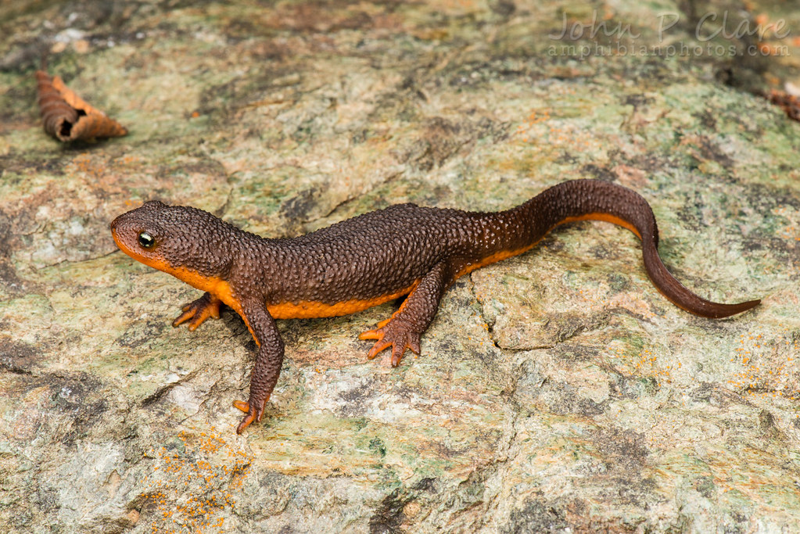

# Gene conversion facilitates the adaptive evolution of self-resistance in highly toxic newts

Investigation of the evolution of tetrodotoxin autoresistance in newts and related salamanders.

This repository includes datasets used in the analyses conducted for [Gendreau et al. (2021)](https://doi.org/10.1093/molbev/msab182). See manuscript for methods.

### 1. Phylogenetic trees

Multiple sequence alignments of all Nav paralogs from amphibians and *Danio rerio* can be downloaded here: [All Navs amino acid alignment](SCNA_protein_alignment_RAxML_Tree.fasta) (**Fig. 1** in Gendreau et al. (2021)) and here: [All Navs full coding sequence alignment](SCN_CDS_alignment_RAxML_Tree.fasta) (**Fig. S2** in Gendreau et al. (2021)).

Alignment of coding sequences for only exon 26 from all Nav paralogs (**Fig. S3** in Gendreau et al. (2021)) can be found here: [All Navs exon 26 alignment](Exon_26_all_SCNAs.fasta).

Alignment of amino acid translations of exon 26 from all Nav paralogs can be found here: [All Navs exon 26 amino acid alignment](Exon26_all_SCNAs_amino_acid.fasta).

Coding sequence alignment for exon 26 of only Nav1.4 (**Fig. 2** in Gendreau et al. (2021)) can be downloaded here: [*SCN4A* exon 26 CDS alignment](SCN4A_exon26_RAxML_Tree.fasta)

Code for trimming species phylogeny and estimating ultrametric trees for visualization in **Figs. 3, 5, and S10 ** can be found here: [Code for trimming phylogeny](amphibian_time_tree.R)

### 2. Evolutionary rates and selection with PAML

Alignment files used for PAML analyses:
* [Nav1.1](SCN1A_CDS_alignment.fasta)
* [Nav1.2](SCN2A_CDS_alignment.fasta)
* [Nav1.3](SCN3A_CDS_alignment.fasta)
* [Nav1.4](SCN4A_CDS_alignment.fasta)
* [Nav1.5](SCN5A_CDS_alignment.fasta)
* [Nav1.6](SCN8A_CDS_alignment.fasta)

### 3. Gene conversion

* [Alignment file](SCNA_amphibian_CDS_alignment_geneconv.fasta) and [configuration file](Geneconv_config_SCN1A-2A-3A.cfg) used to search for gene conversion in Nav1.1, Nav1.2, and Nav1.3. Output files: [SCNA_amphibian_CDS_alignment_PAL2NAL.frags](SCNA_amphibian_CDS_alignment_PAL2NAL.frags) and [SCNA_amphibian_CDS_alignment_PAL2NAL.sum](SCNA_amphibian_CDS_alignment_PAL2NAL.sum).

* [Alignment file](SCN4A_exon_26_alignment_geneconv.fasta) and [configuration file](Geneconv_config_SCN4A.cfg) used to search for gene conversion in Nav1.4 exons 26a and 26b. Output files: [SCN4ADIVa_2.frags](SCN4ADIVa_2.frags) and [SCN4ADIVa_2.sum](SCN4ADIVa_2.sum)

### 3. Probe sequences

* [Probe sequences used for targeted sequencing of amphibian Nav genes](Amphibian_SCN_probes.txt)

